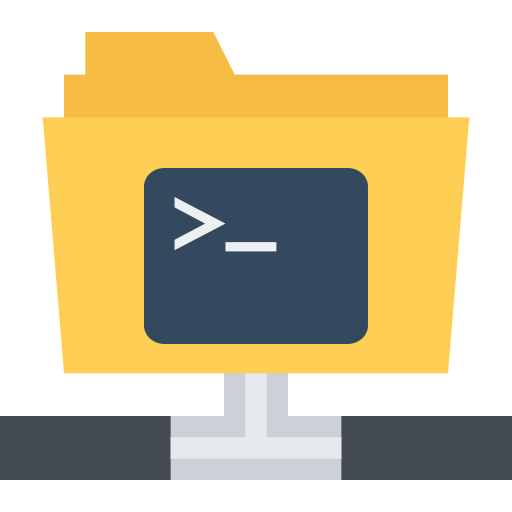

<p align="center">
	
	<h1 align="center">sftpman-iced</h1>
</p>

`sftpman-iced` is a GUI application for Linux systems that makes it easy to setup and mount [sshfs](https://github.com/libfuse/sshfs)/[SFTP](https://en.wikipedia.org/wiki/SSH_File_Transfer_Protocol) filesystems.

It's a GUI frontend to the [sftpman](https://github.com/spantaleev/sftpman-rs) command line application and library (`libsftpman`). See the [sftpman](https://github.com/spantaleev/sftpman-rs) repository for more information.

## 📸 Screenshots

1. [sftpman-iced home screen](./assets/screenshots/sftpman-iced-home.png)
2. [sftpman-iced record screen](./assets/screenshots/sftpman-iced-record.png)

## 🚀 Installing

### Dependencies

- `libsftpman`, provided by [sftpman](https://github.com/spantaleev/sftpman-rs)

- [sshfs](https://github.com/libfuse/sshfs), required by [sftpman](https://github.com/spantaleev/sftpman-rs)

- an askpass application, so you can be asked to enter SSH key passphrases. Examples are: [ksshaskpass](https://github.com/KDE/ksshaskpass) (included in KDE Plasma), [seahorse](https://wiki.gnome.org/Apps/Seahorse) (included in GNOME). Also see [Alternative passphrase dialogs](https://wiki.archlinux.org/title/SSH_keys#Alternative_passphrase_dialogs) on the ArchLinux wiki.

💡 **Note**: Installing the `sftpman-iced` GUI application will automatically pull the `libsftpman` library (provided by [sftpman](https://github.com/spantaleev/sftpman-rs)) as a dependency, but will **not** automatically install the `sftpman` CLI binary.

### Installing on ArchLinux

For [ArchLinux](http://www.archlinux.org/), there's an [sftpman-iced](https://aur.archlinux.org/packages/sftpman-iced) package in the [AUR](https://wiki.archlinux.org/title/Arch_User_Repository).

### Installing on other distributions

For other Linux distributions you can install using [cargo](https://doc.rust-lang.org/cargo/):

```sh
cargo install sftpman-iced
```

You also need to:

- install [sshfs](https://github.com/libfuse/sshfs) yourself

- make sure the `/mnt/sshfs` directory exists and is writable (e.g. `mkdir /mnt/sshfs && chown root:users /mnt/sshfs && chmod 0775 /mnt/sshfs`)


## ❓ FAQ

### Why was sftpman-gtk rewritten to sftpman-iced?

Since the underlying CLI application and library (`sftpman`) was rewritten from [Python](https://www.python.org/) to [Rust](https://www.rust-lang.org/), we found ourselves having to rewrite the GUI application as well.

Also see:

- [Why was iced chosen as a UI framework instead of Gtk?](#why-was-iced-chosen-as-a-ui-framework-instead-of-gtk)
- [Why was iced chosen as a UI framework instead of Qt?](#why-was-iced-chosen-as-a-ui-framework-instead-of-qt)
- [Why was iced chosen as a UI framework instead of Slint?](#why-was-iced-chosen-as-a-ui-framework-instead-of-slint)


### Why was iced chosen as a UI framework instead of Gtk?

Also see: [Why was sftpman-gtk rewritten to sftpman-iced?](#why-was-sftpman-gtk-rewritten-to-sftpman-iced).

[GNOME](https://www.gnome.org/) has been becoming more dumbed-down and its [Gtk](https://www.gtk.org/) UI framework has been starting to feel more alien on other [Desktop Environments](https://wiki.archlinux.org/title/Desktop_environment) (like [KDE](https://kde.org/)).

Furthermore, the imperative nature of Gtk makes it an ugly mess to develop for. Choosing a declarative UI framework was deemed a better choice.

The [Rust](https://www.rust-lang.org/) bindings for various UI frameworks ([Gtk](https://www.gtk.org/), [Qt](https://www.qt.io/product/framework), etc.) are all poor and [iced](https://iced.rs/) ticked all our boxes.


### Why was iced chosen as a UI framework instead of Qt?

Also see: [Why was sftpman-gtk rewritten to sftpman-iced?](#why-was-sftpman-gtk-rewritten-to-sftpman-iced).

When working on this rewrite, we gave [Qt](https://www.qt.io/product/framework) a try via [qmetaobject-rs](https://github.com/woboq/qmetaobject-rs).
It felt like a very fragile and ugly way to write code.

[Rust](https://www.rust-lang.org/) bindings for [Qt](https://www.qt.io/product/framework) are all in a poor state and are likely to remain this way.


### Why was iced chosen as a UI framework instead of Slint?

Also see: [Why was sftpman-gtk rewritten to sftpman-iced?](#why-was-sftpman-gtk-rewritten-to-sftpman-iced).

When working on this rewrite, we gave [Slint](https://slint.dev/) a try.

While it seems like a promising UI framework, we weren't sure another commerical Qt clone is an ideal choice.

We also found that Slint yielded very large executables even for simple "Hello world" application.
iced executables are not tiny either, but our complete `sftpman-iced` binary appears to be on par with Slint's "Hello world" (~17 MB).


### Why was iced chosen given that it has poor accessibility?

[Accessibility support](https://github.com/iced-rs/iced/issues/552) in [iced](https://github.com/iced-rs/iced) is currently lacking.
This is usually an important reason to look past it.

Since we provide a more accessible CLI application (see [sftpman](https://github.com/spantaleev/sftpman-rs)) which can serve as a substitute to various handicapped users, we believe the lack of accessibility support is not a deal-breaker for us.


### Why does sftpman-iced temporarily freeze during mounting?

Mounting is done by delegating to the [sshfs](https://github.com/libfuse/sshfs) command line application.

If `sshfs` needs to ask you for an SSH key passphrase or password, it will create a dialog box (via [ssh-askpass](https://man.openbsd.org/ssh-askpass.1), etc.) that does it.

We start `sshfs` on the main thread so that this dialog box can be displayed and interacted with correctly.


### Why does sftpman-iced temporarily freeze during unmounting?

Unmounting (running `fusermount -u ..` commands, etc.) can more easily be accomplished in the background, but we haven't implemented it because:

- unmounting is usually quick and doing it sequentially does not impact performance too much

- we don't yet support displaying multiple error alerts at the same time. If multiple filesystems are being unmounted in parallel and they all error out, we would need to notify you properly (something which we can't do yet).

- not blocking the main thread while unmounting would allow you to (accidentally) trigger a mount operation while unmounting is still in progress. Handling this gracefully will need further work.


#### Is sftpman-iced compatible with sftpman-gtk?

[sftpman](https://github.com/spantaleev/sftpman-rs) v2 (and the [sftpman-iced](https://github.com/spantaleev/sftpman-iced-rs) GUI frontend) are still **mostly-backward compatible** with the old Python-based `sftpman` software ([sftpman-python](https://github.com/spantaleev/sftpman-python) and the associated [sftman-gtk](https://github.com/spantaleev/sftpman-gtk)):

- ✅ The old configuration files can be read and used as-is

- ✨ You can now use custom local mount endpoints for filesystems, instead of just the default `/mnt/sshfs/{id}` directory

Also see: [Is sftpman v2 compatible with sftpman v1?](https://github.com/spantaleev/sftpman-rs/blob/master/README.md#is-sftpman-v2-compatible-with-sftpman-v1)


## Acknowledgements

`sftpman-iced` is built with [iced](https://github.com/iced-rs/iced) - a cross-platform GUI library for Rust focused on simplicity and type-safety.

<p align="center">
<a href="https://github.com/iced-rs/iced">

</a>
</p>

The application includes icons from [Bootstrap Icons](https://icons.getbootstrap.com/), licensed under the [MIT license](./assets/bootstrap-icons/LICENSE). See the [assets/bootstrap-icons](assets/bootstrap-icons) directory.
